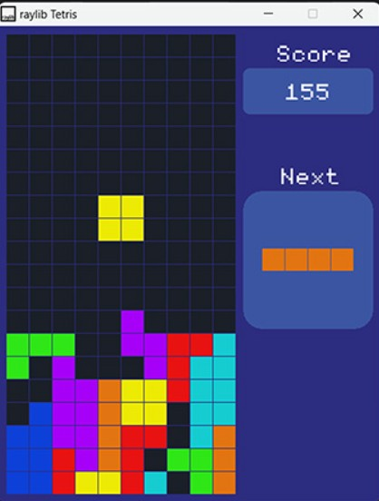

# C++ Tetris Game using raylib

Welcome to the C++ Tetris Game repository! This project showcases a classic Tetris game built with the C++ programming language and the raylib library. The game is designed to run smoothly on Windows, macOS, and Linux.

## Table of Contents

- [Features](#features)
- [Installation](#installation)
- [Usage](#usage)
- [Gameplay](#gameplay)
- [Contributing](#contributing)
- [Credits](#credits)

## Features

- **Cross-Platform**: Playable on Windows, macOS, and Linux.
- **Graphics**: Utilizes raylib for rendering colorful and dynamic graphics.
- **Audio**: Engaging sound effects and background music powered by raylib.
- **Input Handling**: Smooth and responsive controls for an enjoyable gaming experience.
- **Open Source**: Well-structured and readable code for educational purposes.

  ## Screenshot



## Installation

To get started with the C++ Tetris game, follow these steps:

### Prerequisites

- Ensure you have a C++ compiler installed (e.g., GCC, Clang, MSVC).
- Download and install the [raylib](https://www.raylib.com/) library.

### Building the Game

1. Clone this repository:
    ```sh
    git clone https://github.com/yourusername/tetris-raylib.git
    cd tetris-raylib
    ```

2. Compile the source code:
    ```sh
    g++ -o tetris main.cpp -lraylib -lm -ldl -lpthread -lX11
    ```

3. Run the game:
    ```sh
    ./tetris
    ```

## Usage

Simply run the compiled executable to start playing the game. Use the following controls to play:

- **Left Arrow**: Move the Tetrimino left
- **Right Arrow**: Move the Tetrimino right
- **Up Arrow**: Rotate the Tetrimino
- **Down Arrow**: Speed up the Tetrimino's descent
- **Spacebar**: Drop the Tetrimino

## Gameplay

The objective of Tetris is to clear lines by guiding falling Tetriminos to fit them into complete horizontal rows. Each cleared line awards points and the game speeds up as you progress. Try to score as high as possible!

## Contributing

Contributions are welcome! If you find any bugs or have ideas for new features, feel free to open an issue or submit a pull request. Please ensure your contributions adhere to the project's coding standards and guidelines.


## Credits

- **raylib**: [Raylib](https://www.raylib.com/) library by [Ray San](https://github.com/raysan5)
- **Tetris Concept**: Originally designed and programmed by Alexey Pajitnov

---

Happy gaming and happy coding! 🎮🚀
